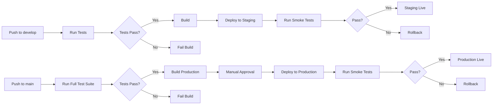

# CI/CD Pipeline and Testing Setup

This document provides an overview of the CI/CD pipeline and automated testing infrastructure for the Playwright & Selenium Learning Platform.

## Table of Contents

1. [Overview](#overview)
2. [Testing Infrastructure](#testing-infrastructure)
3. [GitHub Actions Workflows](#github-actions-workflows)
4. [Deployment Pipeline](#deployment-pipeline)
5. [Security Scanning](#security-scanning)
6. [Setup Instructions](#setup-instructions)
7. [Usage](#usage)

## Overview

The project uses a comprehensive CI/CD pipeline with:

- **Automated Testing**: Unit, integration, and E2E tests
- **Code Quality**: Linting, type checking, and coverage reporting
- **Security**: Vulnerability scanning and secret detection
- **Deployment**: Automated deployments to staging and production
- **Monitoring**: Test results, coverage reports, and deployment status

## Testing Infrastructure

### Test Types

1. **Unit Tests** (Vitest)
   - Fast, isolated tests for individual functions and components
   - Coverage threshold: 80%
   - Location: `frontend/tests/unit/`

2. **Integration Tests** (Vitest + Testing Library)
   - Tests for component interactions and API integrations
   - Location: `frontend/tests/integration/`

3. **E2E Tests** (Playwright)
   - Full user flow testing across multiple browsers
   - Visual regression testing
   - Location: `frontend/tests/e2e/`

4. **Playwright Runner Tests**
   - Example tests and exercises
   - Cross-browser and cross-platform testing
   - Location: `playwright-runner/tests/`

5. **Selenium Tests** (Java)
   - Java-based Selenium tests
   - Location: `selenium-java/src/test/`

### Test Configuration Files

```
frontend/
├── vitest.config.ts          # Vitest configuration
├── playwright.config.ts       # Playwright E2E configuration
├── lighthouserc.json         # Lighthouse CI configuration
└── tests/
    ├── setup.ts              # Test setup and global mocks
    ├── utils/                # Test utilities
    ├── unit/                 # Unit tests
    ├── integration/          # Integration tests
    └── e2e/                  # E2E tests
```

## GitHub Actions Workflows

### CI Workflow (`.github/workflows/ci.yml`)

Runs on every push and PR to `main` and `develop` branches.

**Jobs:**
- Lint: ESLint and Prettier checks
- Type Check: TypeScript type checking
- Security: Trivy vulnerability scanning and npm audit
- Build: Build all projects
- Test Matrix: Run tests on multiple Node.js versions

### Frontend Workflow (`.github/workflows/frontend.yml`)

**Jobs:**
- Test: Run unit tests with coverage
- E2E: Run Playwright tests
- Accessibility: Lighthouse CI checks

### Playwright Workflow (`.github/workflows/playwright.yml`)

**Jobs:**
- Test: Cross-browser and cross-platform testing
- Mobile: Mobile browser testing
- Visual Regression: Screenshot comparison

### Selenium Workflow (`.github/workflows/selenium.yml`)

**Jobs:**
- Test: Cross-browser Selenium tests with Java
- Headless: Headless browser testing

### Deployment Workflows

#### Staging (`.github/workflows/deploy-staging.yml`)
- Triggered on push to `develop` branch
- Runs tests, builds, and deploys to staging
- Runs smoke tests on staging environment

#### Production (`.github/workflows/deploy-production.yml`)
- Triggered on push to `main` branch or manual trigger
- Requires manual approval
- Full test suite execution
- Coverage threshold check
- Deploy to production
- Run smoke tests
- Database migrations
- Create deployment tag

#### Preview Deployment (`.github/workflows/preview-deployment.yml`)
- Triggered on PR creation/update
- Deploy preview to temporary URL
- Run E2E tests on preview
- Visual regression testing
- Accessibility checks
- Comment PR with preview URL and test results

### Security Workflow (`.github/workflows/security.yml`)

Runs daily and on every push/PR.

**Jobs:**
- Dependency Check: npm audit
- CodeQL: Static code analysis
- Trivy: Container and filesystem scanning
- Snyk: Vulnerability scanning
- Secret Scan: Detect leaked secrets
- OSV Scanner: Open source vulnerability scanning
- License Check: License compliance

## Deployment Pipeline

### Environments

1. **Development** (Local)
   - Local development server
   - Hot module reloading
   - Debug mode enabled

2. **Staging**
   - Auto-deployed from `develop` branch
   - Mirror of production
   - URL: `https://staging.playwright-selenium-learning.com`

3. **Production**
   - Deployed from `main` branch
   - Requires approval
   - URL: `https://playwright-selenium-learning.com`

### Deployment Process



## Security Scanning

### Automated Security Checks

1. **Dependency Scanning**: npm audit, Snyk
2. **Code Analysis**: CodeQL, Trivy
3. **Secret Detection**: Gitleaks
4. **License Compliance**: license-checker
5. **Container Scanning**: Trivy

### Security Workflow Schedule

- **Daily**: Full security scan at 1 AM UTC
- **On Push**: Basic security checks
- **On PR**: Security scan before merge

## Setup Instructions

### 1. Local Development Setup

```bash
# Clone the repository
git clone https://github.com/your-org/playwright-selenium-learning.git
cd playwright-selenium-learning

# Run the setup script
chmod +x scripts/setup-dev.sh
./scripts/setup-dev.sh
```

### 2. CI/CD Setup

```bash
# Set up GitHub Actions secrets and environments
chmod +x scripts/setup-cicd.sh
./scripts/setup-cicd.sh
```

Required secrets:
- `VERCEL_TOKEN`: Vercel authentication token
- `VERCEL_ORG_ID`: Vercel organization ID
- `VERCEL_PROJECT_ID`: Vercel project ID
- `STAGING_API_URL`: Staging API URL
- `PRODUCTION_API_URL`: Production API URL
- `SLACK_WEBHOOK`: Slack webhook for notifications
- `SNYK_TOKEN`: Snyk authentication token (optional)

### 3. Configure Environments

GitHub Environments:
- **staging**: No approval required
- **production**: Requires approval from designated reviewers

## Usage

### Running Tests Locally

```bash
# Run all tests
./scripts/test.sh all

# Run specific test types
./scripts/test.sh unit
./scripts/test.sh integration
./scripts/test.sh e2e
./scripts/test.sh playwright

# Frontend tests
cd frontend
npm run test              # Run unit tests (watch mode)
npm run test:ui          # Run tests with UI
npm run test:e2e         # Run E2E tests
npm run test -- --coverage  # Run with coverage

# Playwright runner tests
cd playwright-runner
npm run test             # Run all tests
npm run test:headed      # Run in headed mode
npm run test:debug       # Debug mode
npm run test:ui          # Interactive UI mode
```

### Manual Deployment

```bash
# Deploy to staging
./scripts/deploy.sh staging

# Deploy to production (requires confirmation)
./scripts/deploy.sh production
```

### Rollback

```bash
# Rollback to previous deployment
./scripts/rollback.sh production

# Rollback to specific version
./scripts/rollback.sh production v1.2.3
```

### Database Migrations

```bash
# Run migrations
./scripts/migrate.sh staging up
./scripts/migrate.sh production up

# Check migration status
./scripts/migrate.sh staging status

# Rollback last migration
./scripts/migrate.sh staging down
```

## Coverage Reports

Coverage reports are generated for every test run and uploaded to Codecov.

**Coverage Thresholds:**
- Statements: 80%
- Branches: 80%
- Functions: 80%
- Lines: 80%

View coverage reports:
- Locally: `frontend/coverage/index.html`
- CI: Uploaded to Codecov
- PR Comments: Automatic coverage comments on PRs

## Test Reports

### Playwright Reports

- HTML Report: Generated after each test run
- JSON Report: Machine-readable format
- JUnit XML: CI integration format

Access reports:
```bash
cd frontend
npm run test:e2e
npx playwright show-report
```

### Vitest Reports

- Terminal: Real-time test results
- Coverage: HTML coverage report
- UI Mode: Interactive test runner

## Continuous Improvement

### Adding New Tests

1. **Unit Test**:
   ```typescript
   // frontend/tests/unit/myFeature.test.ts
   import { describe, it, expect } from 'vitest';

   describe('My Feature', () => {
     it('should work correctly', () => {
       expect(true).toBe(true);
     });
   });
   ```

2. **E2E Test**:
   ```typescript
   // frontend/tests/e2e/myFeature.spec.ts
   import { test, expect } from './fixtures';

   test('should navigate correctly', async ({ page }) => {
     await page.goto('/');
     await expect(page).toHaveTitle(/My App/);
   });
   ```

### Updating Workflows

Workflow files are located in `.github/workflows/`. After updating:

1. Test locally with `act` (GitHub Actions local runner)
2. Create a PR to test in CI environment
3. Monitor workflow execution
4. Merge after successful testing

## Troubleshooting

### Common Issues

1. **Tests failing in CI but passing locally**
   - Check Node.js versions match
   - Verify environment variables
   - Check for timing issues in tests

2. **Deployment failures**
   - Verify secrets are configured
   - Check build logs
   - Verify environment URLs

3. **Coverage below threshold**
   - Run coverage report locally
   - Identify untested code
   - Add tests for uncovered lines

### Debug Commands

```bash
# Run tests in debug mode
npm run test:debug

# Run specific test file
npm run test -- path/to/test.ts

# Run tests matching pattern
npm run test -- --grep "pattern"

# Show detailed logs
npm run test -- --reporter=verbose
```

## Best Practices

1. **Write tests before pushing**: Run tests locally before committing
2. **Keep tests fast**: Unit tests should run in milliseconds
3. **Use fixtures**: Share test setup across multiple tests
4. **Mock external dependencies**: Avoid flaky tests
5. **Tag critical tests**: Use `@smoke` tag for smoke tests
6. **Update tests with code changes**: Keep tests in sync
7. **Review coverage reports**: Aim for meaningful coverage
8. **Monitor CI/CD metrics**: Track build times and success rates

## Resources

- [Vitest Documentation](https://vitest.dev/)
- [Playwright Documentation](https://playwright.dev/)
- [Testing Library](https://testing-library.com/)
- [GitHub Actions](https://docs.github.com/en/actions)
- [Vercel Deployment](https://vercel.com/docs)

## Support

For issues or questions:
1. Check the [troubleshooting guide](#troubleshooting)
2. Review CI logs in GitHub Actions
3. Contact the DevOps team
4. Create an issue in the repository
