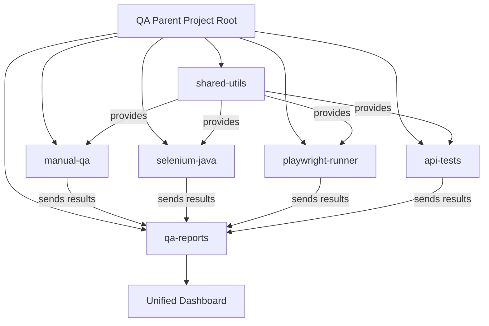
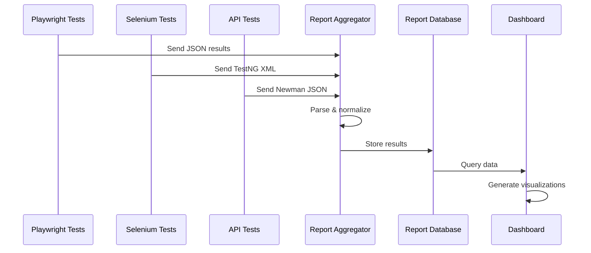

# Modular QA Project Architecture Plan

## Executive Summary

This document outlines the architecture for a **monorepo-based modular QA project** where a parent "QA" project manages multiple testing sub-projects (Manual QA, Selenium, Playwright, etc.) as independent modules with shared utilities and unified reporting.

**Recommendation: Monorepo with npm/pnpm Workspaces** - This is the simplest and most maintainable approach for your use case.

---

## Current State Analysis

Your existing project structure already contains:
- [`playwright-runner/`](playwright-runner/) - Playwright test examples with npm
- [`selenium-java/`](selenium-java/) - Selenium tests with Maven
- [`tests/`](tests/) - Additional test directories (accessibility, ai, i18n)
- [`frontend/`](frontend/) and [`backend/`](backend/) - Main application

**Key Observation:** You already have a multi-module structure, but it lacks:
1. Unified dependency management
2. Shared utilities across test projects
3. Centralized reporting
4. Single command execution for all tests

---

## Proposed Architecture: Monorepo with Workspaces

### Architecture Overview



### Why Monorepo with Workspaces?

**Advantages:**
- ✅ Simple to set up and manage
- ✅ Single repository for all QA projects
- ✅ Shared dependencies and utilities
- ✅ Run all tests with one command
- ✅ Consistent versioning
- ✅ Easy CI/CD integration
- ✅ Each module can use different tech stacks

**Compared to Alternatives:**
- **Git Submodules**: More complex, harder to sync
- **Microservices**: Overkill for testing projects
- **Separate Repos**: Difficult to share code and maintain consistency

---

## Recommended Directory Structure

```
qa-automation/                    # Parent project root
│
├── package.json                  # Root workspace configuration
├── pnpm-workspace.yaml          # Workspace definition
├── .gitignore
├── README.md
│
├── packages/                     # All modules live here
│   │
│   ├── shared-utils/            # Shared utilities module
│   │   ├── package.json
│   │   ├── src/
│   │   │   ├── reporters/       # Custom reporters
│   │   │   ├── helpers/         # Test helpers
│   │   │   ├── config/          # Shared configs
│   │   │   └── types/           # TypeScript types
│   │   └── index.ts
│   │
│   ├── manual-qa/               # Manual testing module
│   │   ├── package.json
│   │   ├── test-cases/          # Test case documents
│   │   ├── checklists/          # QA checklists
│   │   ├── bug-reports/         # Bug tracking
│   │   └── scripts/             # Helper scripts
│   │
│   ├── playwright-tests/        # Playwright module
│   │   ├── package.json
│   │   ├── playwright.config.ts
│   │   ├── tests/
│   │   │   ├── e2e/
│   │   │   ├── integration/
│   │   │   └── visual/
│   │   └── fixtures/
│   │
│   ├── selenium-tests/          # Selenium module
│   │   ├── pom.xml
│   │   ├── testng.xml
│   │   ├── src/
│   │   │   ├── main/java/
│   │   │   └── test/java/
│   │   └── README.md
│   │
│   ├── api-tests/               # API testing module
│   │   ├── package.json
│   │   ├── tests/
│   │   │   ├── rest/
│   │   │   └── graphql/
│   │   └── collections/         # Postman/Newman
│   │
│   ├── performance-tests/       # Performance testing
│   │   ├── package.json
│   │   ├── k6-scripts/
│   │   └── jmeter-plans/
│   │
│   └── qa-dashboard/            # Unified reporting dashboard
│       ├── package.json
│       ├── src/
│       │   ├── aggregator/      # Collect results
│       │   ├── visualizer/      # Charts and graphs
│       │   └── api/             # Dashboard API
│       └── public/
│
├── scripts/                      # Root-level scripts
│   ├── run-all-tests.sh
│   ├── generate-report.sh
│   └── setup-modules.sh
│
├── config/                       # Global configurations
│   ├── jest.config.base.js
│   ├── eslint.config.js
│   └── tsconfig.base.json
│
└── reports/                      # Consolidated reports
    ├── playwright/
    ├── selenium/
    ├── api/
    └── unified/
```

---

## Technical Stack Recommendations

### 1. Parent Project (Root)
- **Package Manager**: `pnpm` (faster, efficient) or `npm workspaces`
- **Task Runner**: `Turborepo` or `npm scripts`
- **Language**: Node.js for orchestration

### 2. Shared Utilities Module
- **Language**: TypeScript/JavaScript
- **Purpose**: 
  - Common test helpers
  - Custom reporters
  - Configuration management
  - Utility functions
- **Stack**:
  ```json
  {
    "dependencies": {
      "@types/node": "^20.0.0",
      "dotenv": "^16.0.0",
      "winston": "^3.11.0"
    }
  }
  ```

### 3. Manual QA Module
- **Tools**: 
  - Markdown for test cases
  - YAML/JSON for test data
  - Jira/TestRail integration scripts
- **Stack**:
  - Node.js scripts for automation
  - Excel/CSV parsers for test case management

### 4. Playwright Tests Module
- **Language**: TypeScript
- **Framework**: Playwright
- **Stack**:
  ```json
  {
    "dependencies": {
      "@playwright/test": "^1.40.0",
      "@qa-automation/shared-utils": "workspace:*"
    }
  }
  ```

### 5. Selenium Tests Module
- **Language**: Java 17+
- **Framework**: TestNG
- **Build Tool**: Maven
- **Stack**:
  ```xml
  <dependencies>
    <dependency>
      <groupId>org.seleniumhq.selenium</groupId>
      <artifactId>selenium-java</artifactId>
      <version>4.16.0</version>
    </dependency>
    <dependency>
      <groupId>org.testng</groupId>
      <artifactId>testng</artifactId>
      <version>7.8.0</version>
    </dependency>
  </dependencies>
  ```

### 6. API Tests Module
- **Language**: TypeScript/JavaScript
- **Frameworks**: 
  - Playwright for API testing
  - Postman/Newman
  - REST Assured (if Java)
- **Stack**:
  ```json
  {
    "dependencies": {
      "@playwright/test": "^1.40.0",
      "newman": "^6.0.0",
      "axios": "^1.6.0"
    }
  }
  ```

### 7. QA Dashboard Module
- **Frontend**: React + TypeScript
- **Backend**: Node.js + Express
- **Database**: SQLite or PostgreSQL
- **Visualization**: Chart.js or Recharts
- **Stack**:
  ```json
  {
    "dependencies": {
      "react": "^18.2.0",
      "express": "^4.18.0",
      "recharts": "^2.10.0",
      "sqlite3": "^5.1.0"
    }
  }
  ```

---

## Configuration Management

### Root package.json (Workspace Configuration)

```json
{
  "name": "qa-automation",
  "version": "1.0.0",
  "private": true,
  "workspaces": [
    "packages/*"
  ],
  "scripts": {
    "test:all": "pnpm -r test",
    "test:playwright": "pnpm --filter playwright-tests test",
    "test:selenium": "cd packages/selenium-tests && mvn test",
    "test:api": "pnpm --filter api-tests test",
    "report": "pnpm --filter qa-dashboard generate-report",
    "install:all": "pnpm install && cd packages/selenium-tests && mvn install",
    "clean": "pnpm -r clean && rm -rf reports/*"
  },
  "devDependencies": {
    "turbo": "^1.11.0",
    "concurrently": "^8.2.0"
  }
}
```

### pnpm-workspace.yaml

```yaml
packages:
  - 'packages/*'
```

### Shared Configuration Files

**config/tsconfig.base.json**
```json
{
  "compilerOptions": {
    "target": "ES2022",
    "module": "commonjs",
    "lib": ["ES2022"],
    "strict": true,
    "esModuleInterop": true,
    "skipLibCheck": true,
    "forceConsistentCasingInFileNames": true,
    "resolveJsonModule": true,
    "declaration": true,
    "declarationMap": true,
    "sourceMap": true,
    "outDir": "./dist"
  }
}
```

---

## Unified Reporting Strategy

### Report Aggregation Flow



### Report Format Standardization

All modules should output to a common format:

```typescript
interface TestResult {
  module: 'playwright' | 'selenium' | 'api' | 'manual';
  timestamp: string;
  duration: number;
  total: number;
  passed: number;
  failed: number;
  skipped: number;
  tests: Array<{
    name: string;
    status: 'passed' | 'failed' | 'skipped';
    duration: number;
    error?: string;
    screenshot?: string;
  }>;
}
```

### Custom Reporter Implementation

**packages/shared-utils/src/reporters/unified-reporter.ts**
```typescript
export class UnifiedReporter {
  async saveResults(results: TestResult): Promise<void> {
    const reportPath = `../../reports/${results.module}/${results.timestamp}.json`;
    await fs.writeFile(reportPath, JSON.stringify(results, null, 2));
    await this.notifyDashboard(results);
  }
  
  private async notifyDashboard(results: TestResult): Promise<void> {
    // Send to dashboard API
    await fetch('http://localhost:4000/api/results', {
      method: 'POST',
      body: JSON.stringify(results)
    });
  }
}
```

---

## Module Integration Patterns

### Pattern 1: Shared Utilities Usage

**In Playwright module:**
```typescript
// packages/playwright-tests/tests/example.spec.ts
import { test, expect } from '@playwright/test';
import { UnifiedReporter } from '@qa-automation/shared-utils';

test('example test', async ({ page }) => {
  // Test code
});

test.afterAll(async () => {
  const reporter = new UnifiedReporter();
  await reporter.saveResults(/* results */);
});
```

**In Selenium module:**
```java
// packages/selenium-tests/src/test/java/BaseTest.java
import com.qa.shared.UnifiedReporter;

public class BaseTest {
    @AfterSuite
    public void reportResults() {
        UnifiedReporter reporter = new UnifiedReporter();
        reporter.saveResults(/* results */);
    }
}
```

### Pattern 2: Cross-Module Dependencies

**packages/playwright-tests/package.json**
```json
{
  "name": "@qa-automation/playwright-tests",
  "dependencies": {
    "@playwright/test": "^1.40.0",
    "@qa-automation/shared-utils": "workspace:*"
  }
}
```

### Pattern 3: Environment Configuration

**config/.env.example**
```bash
# Application URLs
APP_URL=http://localhost:3000
API_URL=http://localhost:3001

# Test Configuration
HEADLESS=true
BROWSER=chromium
TIMEOUT=30000

# Reporting
DASHBOARD_URL=http://localhost:4000
ENABLE_SCREENSHOTS=true
ENABLE_VIDEO=false

# CI/CD
CI=false
PARALLEL_WORKERS=4
```

---

## CI/CD Integration Strategy

### GitHub Actions Workflow

**.github/workflows/qa-tests.yml**
```yaml
name: QA Test Suite

on:
  push:
    branches: [main, develop]
  pull_request:
    branches: [main]
  schedule:
    - cron: '0 2 * * *'  # Daily at 2 AM

jobs:
  playwright-tests:
    runs-on: ubuntu-latest
    steps:
      - uses: actions/checkout@v4
      - uses: pnpm/action-setup@v2
        with:
          version: 8
      - uses: actions/setup-node@v4
        with:
          node-version: 20
          cache: 'pnpm'
      
      - name: Install dependencies
        run: pnpm install
      
      - name: Install Playwright browsers
        run: pnpm --filter playwright-tests exec playwright install --with-deps
      
      - name: Run Playwright tests
        run: pnpm test:playwright
      
      - name: Upload test results
        uses: actions/upload-artifact@v4
        if: always()
        with:
          name: playwright-results
          path: packages/playwright-tests/test-results/

  selenium-tests:
    runs-on: ubuntu-latest
    steps:
      - uses: actions/checkout@v4
      - uses: actions/setup-java@v4
        with:
          java-version: '17'
          distribution: 'temurin'
      
      - name: Run Selenium tests
        run: |
          cd packages/selenium-tests
          mvn clean test
      
      - name: Upload test results
        uses: actions/upload-artifact@v4
        if: always()
        with:
          name: selenium-results
          path: packages/selenium-tests/target/surefire-reports/

  api-tests:
    runs-on: ubuntu-latest
    steps:
      - uses: actions/checkout@v4
      - uses: pnpm/action-setup@v2
      - uses: actions/setup-node@v4
        with:
          node-version: 20
          cache: 'pnpm'
      
      - name: Install dependencies
        run: pnpm install
      
      - name: Run API tests
        run: pnpm test:api

  generate-report:
    needs: [playwright-tests, selenium-tests, api-tests]
    runs-on: ubuntu-latest
    if: always()
    steps:
      - uses: actions/checkout@v4
      - uses: pnpm/action-setup@v2
      - uses: actions/setup-node@v4
        with:
          node-version: 20
          cache: 'pnpm'
      
      - name: Download all artifacts
        uses: actions/download-artifact@v4
      
      - name: Generate unified report
        run: pnpm report
      
      - name: Publish report
        uses: peaceiris/actions-gh-pages@v3
        with:
          github_token: ${{ secrets.GITHUB_TOKEN }}
          publish_dir: ./reports/unified
```

### Parallel Execution Strategy

```yaml
# For faster execution
jobs:
  test-matrix:
    strategy:
      matrix:
        module: [playwright-tests, api-tests]
        shard: [1, 2, 3, 4]
    runs-on: ubuntu-latest
    steps:
      - name: Run tests
        run: pnpm --filter ${{ matrix.module }} test --shard=${{ matrix.shard }}/4
```

---

## Implementation Roadmap

### Phase 1: Foundation Setup
1. Create root workspace structure
2. Set up pnpm workspaces
3. Create shared-utils package
4. Define common interfaces and types

### Phase 2: Module Migration
1. Migrate existing playwright-runner to packages/playwright-tests
2. Migrate existing selenium-java to packages/selenium-tests
3. Update dependencies to use workspace protocol
4. Integrate shared utilities

### Phase 3: New Modules
1. Create manual-qa module with templates
2. Create api-tests module
3. Set up performance-tests module (optional)

### Phase 4: Reporting Infrastructure
1. Build qa-dashboard module
2. Implement report aggregator
3. Create custom reporters for each module
4. Set up database for historical data

### Phase 5: CI/CD Integration
1. Configure GitHub Actions workflows
2. Set up parallel execution
3. Implement automated reporting
4. Configure notifications (Slack, email)

### Phase 6: Documentation & Training
1. Write comprehensive README for each module
2. Create contribution guidelines
3. Document best practices
4. Create video tutorials

---

## Best Practices

### 1. Module Independence
- Each module should be runnable independently
- Avoid tight coupling between modules
- Use shared-utils for common functionality only

### 2. Versioning Strategy
- Use semantic versioning for all packages
- Keep shared-utils version in sync
- Document breaking changes

### 3. Code Organization
```
Each module should have:
├── README.md           # Module-specific documentation
├── package.json        # Dependencies and scripts
├── tsconfig.json       # Extends base config
├── .env.example        # Environment variables
├── tests/              # Test files
└── fixtures/           # Test data
```

### 4. Naming Conventions
- Modules: `@qa-automation/module-name`
- Test files: `*.spec.ts` or `*.test.ts`
- Page objects: `*.page.ts`
- Utilities: `*.util.ts`

### 5. Error Handling
```typescript
// Centralized error handling in shared-utils
export class TestError extends Error {
  constructor(
    message: string,
    public module: string,
    public testName: string
  ) {
    super(message);
  }
}
```

### 6. Logging Strategy
```typescript
// Use winston for consistent logging
import { createLogger } from '@qa-automation/shared-utils';

const logger = createLogger('playwright-tests');
logger.info('Starting test suite');
logger.error('Test failed', { error, testName });
```

---

## Migration from Current Structure

### Step-by-Step Migration

1. **Create new structure**
   ```bash
   mkdir -p packages/{shared-utils,playwright-tests,selenium-tests,manual-qa,api-tests,qa-dashboard}
   ```

2. **Move existing projects**
   ```bash
   mv playwright-runner/* packages/playwright-tests/
   mv selenium-java/* packages/selenium-tests/
   ```

3. **Set up workspace**
   ```bash
   # Create root package.json
   pnpm init
   
   # Create pnpm-workspace.yaml
   echo "packages:\n  - 'packages/*'" > pnpm-workspace.yaml
   ```

4. **Update dependencies**
   ```bash
   # In each package
   cd packages/playwright-tests
   pnpm add @qa-automation/shared-utils@workspace:*
   ```

5. **Test migration**
   ```bash
   pnpm install
   pnpm test:all
   ```

---

## Cost-Benefit Analysis

### Benefits
- ✅ Single source of truth for all QA activities
- ✅ Reduced code duplication
- ✅ Easier onboarding for new team members
- ✅ Consistent reporting across all test types
- ✅ Simplified CI/CD configuration
- ✅ Better visibility into overall QA health

### Challenges
- ⚠️ Initial setup effort
- ⚠️ Learning curve for workspace management
- ⚠️ Need to maintain shared utilities
- ⚠️ Potential for monorepo to grow large

### Mitigation Strategies
- Start small with 2-3 modules
- Document everything thoroughly
- Use Turborepo for better performance
- Implement strict code review process

---

## Alternative Approaches Considered

### 1. Git Submodules
**Pros**: Complete independence
**Cons**: Complex synchronization, harder to share code
**Verdict**: ❌ Too complex for this use case

### 2. Separate Repositories
**Pros**: Maximum isolation
**Cons**: Code duplication, difficult to maintain consistency
**Verdict**: ❌ Not suitable for integrated QA

### 3. Microservices Architecture
**Pros**: Scalable, independent deployment
**Cons**: Overkill for testing projects, complex infrastructure
**Verdict**: ❌ Too heavy for testing automation

### 4. Monorepo with Workspaces (Recommended)
**Pros**: Simple, maintainable, shared code, unified tooling
**Cons**: Requires discipline, can grow large
**Verdict**: ✅ Best fit for your requirements

---

## Success Metrics

Track these metrics to measure success:

1. **Test Execution Time**: Should decrease with parallel execution
2. **Code Reuse**: Percentage of shared utilities usage
3. **Maintenance Effort**: Time to add new test modules
4. **CI/CD Performance**: Build and test duration
5. **Developer Satisfaction**: Team feedback on workflow
6. **Test Coverage**: Overall application coverage
7. **Bug Detection Rate**: Tests catching bugs before production

---

## Conclusion

The **monorepo with npm/pnpm workspaces** approach provides the simplest and most maintainable solution for your modular QA project. It allows you to:

- Treat each testing framework as an independent module
- Share common utilities and configurations
- Execute all tests with single commands
- Generate unified reports
- Scale by adding new modules easily

This architecture balances simplicity with power, making it ideal for teams of any size.
