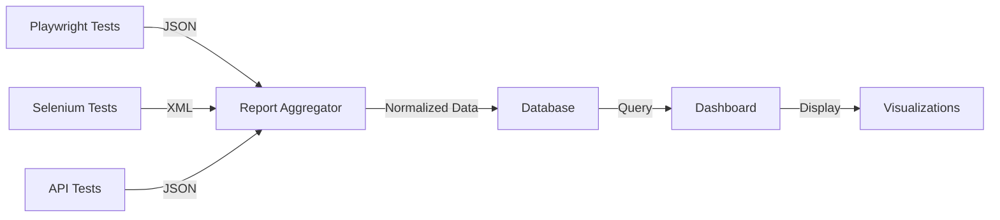

# Modular QA Project - Quick Reference Guide

## 🎯 Overview

This guide provides a quick reference for the modular QA project architecture using a monorepo approach with pnpm workspaces.

---

## 📁 Project Structure at a Glance

```
qa-automation/
├── packages/
│   ├── shared-utils/          # Common utilities for all modules
│   ├── playwright-tests/      # Playwright E2E tests
│   ├── selenium-tests/        # Selenium tests (Java)
│   ├── api-tests/             # API testing
│   ├── manual-qa/             # Manual test cases & checklists
│   └── qa-dashboard/          # Unified reporting dashboard
├── config/                    # Shared configurations
├── scripts/                   # Automation scripts
├── reports/                   # Test results
├── package.json              # Root workspace config
└── pnpm-workspace.yaml       # Workspace definition
```

---

## 🚀 Quick Start Commands

### Initial Setup
```bash
# Install pnpm globally
npm install -g pnpm

# Install all dependencies
pnpm install

# Set up all modules
pnpm run setup:all
```

### Running Tests
```bash
# Run all tests across all modules
pnpm test:all

# Run specific module tests
pnpm test:playwright
pnpm test:selenium
pnpm test:api

# Run tests in parallel
pnpm test:all --parallel
```

### Working with Modules
```bash
# Add dependency to specific module
pnpm --filter playwright-tests add <package-name>

# Run command in specific module
pnpm --filter selenium-tests test

# Run command in all modules
pnpm -r test
```

### Reporting
```bash
# Generate unified report
pnpm report

# Start dashboard locally
pnpm dev:dashboard

# Clean all reports
pnpm clean
```

---

## 🏗️ Architecture Patterns

### 1. Module Structure Template

Every module should follow this structure:
```
packages/module-name/
├── README.md              # Module documentation
├── package.json           # Dependencies & scripts
├── tsconfig.json          # TypeScript config (extends base)
├── .env.example           # Environment variables
├── tests/                 # Test files
├── fixtures/              # Test data
└── utils/                 # Module-specific utilities
```

### 2. Using Shared Utilities

```typescript
// In any module
import { UnifiedReporter, TestHelper } from '@qa-automation/shared-utils';

const reporter = new UnifiedReporter();
await reporter.saveResults(testResults);
```

### 3. Adding a New Module

```bash
# 1. Create module directory
mkdir packages/new-module

# 2. Initialize package.json
cd packages/new-module
pnpm init

# 3. Add shared utilities dependency
pnpm add @qa-automation/shared-utils@workspace:*

# 4. Create basic structure
mkdir tests fixtures utils

# 5. Add to root scripts
# Edit root package.json to add test:new-module script
```

---

## 🔧 Technical Stack Summary

| Component | Technology | Purpose |
|-----------|-----------|---------|
| **Package Manager** | pnpm | Workspace management |
| **Shared Utils** | TypeScript | Common functionality |
| **Playwright Tests** | TypeScript + Playwright | E2E testing |
| **Selenium Tests** | Java + TestNG | Browser automation |
| **API Tests** | TypeScript + Playwright | API testing |
| **Manual QA** | Markdown + Scripts | Test case management |
| **Dashboard** | React + Express | Unified reporting |
| **CI/CD** | GitHub Actions | Automation |

---

## 📊 Reporting Flow



---

## 🔑 Key Configuration Files

### Root package.json
```json
{
  "name": "qa-automation",
  "private": true,
  "workspaces": ["packages/*"],
  "scripts": {
    "test:all": "pnpm -r test",
    "test:playwright": "pnpm --filter playwright-tests test",
    "test:selenium": "cd packages/selenium-tests && mvn test",
    "report": "pnpm --filter qa-dashboard generate-report"
  }
}
```

### pnpm-workspace.yaml
```yaml
packages:
  - 'packages/*'
```

### config/tsconfig.base.json
```json
{
  "compilerOptions": {
    "target": "ES2022",
    "module": "commonjs",
    "strict": true,
    "esModuleInterop": true
  }
}
```

---

## 🎨 Module-Specific Quick Refs

### Playwright Tests
```bash
# Run tests
pnpm --filter playwright-tests test

# Run in UI mode
pnpm --filter playwright-tests test:ui

# Run specific test
pnpm --filter playwright-tests test tests/login.spec.ts
```

### Selenium Tests
```bash
# Run all tests
cd packages/selenium-tests && mvn test

# Run specific test class
mvn test -Dtest=LoginTests

# Generate report
mvn surefire-report:report
```

### API Tests
```bash
# Run API tests
pnpm --filter api-tests test

# Run with specific environment
pnpm --filter api-tests test --env=staging
```

---

## 🐛 Common Issues & Solutions

### Issue: Module not found
```bash
# Solution: Reinstall dependencies
pnpm install
```

### Issue: Workspace dependency not resolving
```bash
# Solution: Use workspace protocol
pnpm add @qa-automation/shared-utils@workspace:*
```

### Issue: Tests not running in CI
```bash
# Solution: Check GitHub Actions workflow
# Ensure all dependencies are installed
# Verify environment variables are set
```

---

## 📈 Best Practices

### 1. Module Independence
- Each module should run independently
- Don't create tight coupling between modules
- Use shared-utils for common functionality only

### 2. Naming Conventions
- Modules: `@qa-automation/module-name`
- Test files: `*.spec.ts` or `*.test.ts`
- Page objects: `*.page.ts`

### 3. Version Management
- Keep shared-utils version in sync
- Use semantic versioning
- Document breaking changes

### 4. Testing Strategy
- Write tests that are independent
- Use fixtures for test data
- Implement proper cleanup

---

## 🔄 CI/CD Integration

### GitHub Actions Workflow
```yaml
name: QA Tests
on: [push, pull_request]

jobs:
  test:
    runs-on: ubuntu-latest
    steps:
      - uses: actions/checkout@v4
      - uses: pnpm/action-setup@v2
      - run: pnpm install
      - run: pnpm test:all
      - run: pnpm report
```

---

## 📚 Documentation Links

- [Full Architecture Plan](./modular-qa-project-architecture.md)
- [Implementation Checklist](./implementation-checklist.md)
- [pnpm Workspaces Docs](https://pnpm.io/workspaces)
- [Playwright Docs](https://playwright.dev)
- [Selenium Docs](https://www.selenium.dev)

---

## 🆘 Getting Help

1. Check module-specific README files
2. Review architecture documentation
3. Check GitHub Issues
4. Contact team lead

---

## 📝 Adding New Test Types

To add a new test type (e.g., mobile, performance):

1. Create new package: `packages/mobile-tests/`
2. Initialize with `pnpm init`
3. Add shared-utils dependency
4. Create test structure
5. Add to root scripts
6. Update CI/CD workflow
7. Document in README

---

## ✅ Success Metrics

Track these to measure effectiveness:
- Test execution time
- Code reuse percentage
- Time to add new modules
- CI/CD performance
- Test coverage
- Bug detection rate

---

## 🎯 Next Steps

After setup:
1. Migrate existing tests to new structure
2. Set up CI/CD pipeline
3. Configure dashboard
4. Train team on new workflow
5. Add more modules as needed

---

**Last Updated:** 2026-04-26
**Version:** 1.0.0
